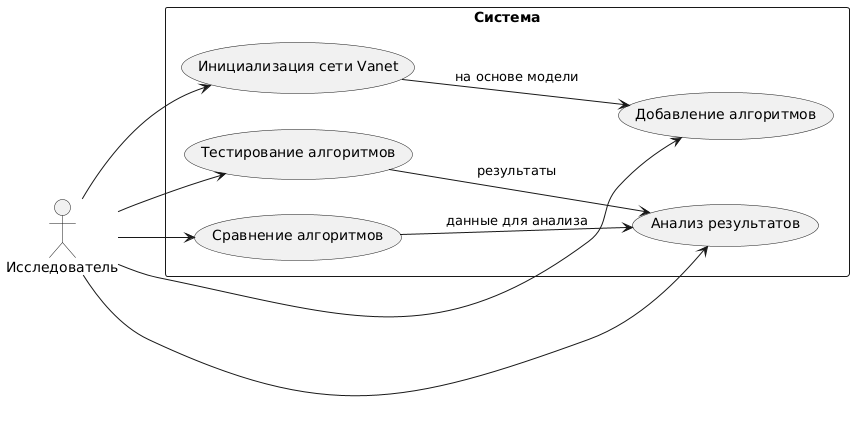

## Лабораторная работа №1.

1. Перечень заинтересованных лиц(стейкхолдеров):
    В контексте исследовательской работы основным стейкхолдером является сам исследователь и косвенные пользователи системы, например, научное сообщество и/или образовательные учреждения.

    **Исследователь (разработчик)** - самостоятельно разрабатывает и использует приложение для анализа биоинспирированных алгоритмов маршрутизации.
    **Научное сообщество** - косвенные пользователи, которым могут быть полезны результаты исследования.
    **Студенты/преподаватели** - используют приложение для обучения и демонстрации алгоритмов маршрутизации.

2. Перечень функциональных требований:

    - Реализация алгоритмов маршрутизации. Возможность тестирования двух биоинспирированных алгоритмов маршрутизации.
    - Моделирование сети IoT. Поддержка создания модели сети с учетом параметров узлов (расстояние, трафик) и топологии сети. А конкретно сетей Vanet.
    - Анализ производительности алгоритмов. Автоматический расчет ключевых метрик эффективности (задержка, пропускная способность).
    - Наличие визуализации данных. Построение диаграмм и таблиц для представления результатов анализа.
    - Сравнение алгоритмов. Возможность тестирования нескольких алгоритмов в одинаковых условиях и сравнение их показателей.

3. Диаграмма вариантов использования.

    

4. Перечень сделанных предположений.

    - Приложение разрабатывается для собственных исследовательских нужд, поэтому интерфейс может быть упрощенным.
    - Исследователь обладает техническими знаниями для настройки сценариев и параметров модели сети.
    - Результаты исследования ориентированы на публикации в научных журналах или использование в образовательных целях.

5. Перечень нефункциональных требований.

    - Тестирование алгоритмов на модели сети с 100 узлами выполняется за 5 секунд.
    - Поддержка моделирования сетей с числом узлов до 500.
    - Алгоритмы и результаты тестов сохраняются для повторных запусков и анализа.
    - Ошибки входных данных не приводят к сбою системы.
