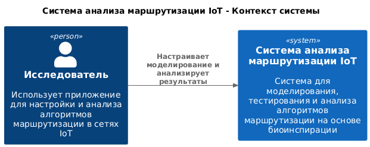
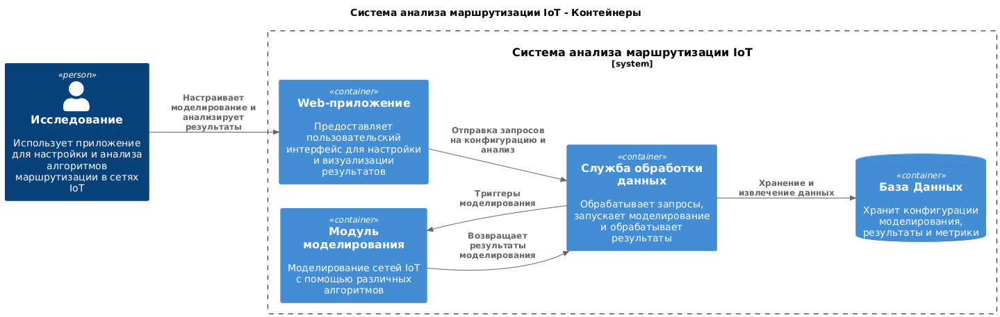
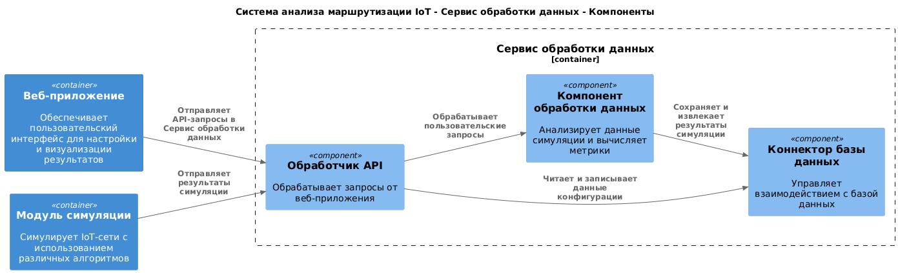
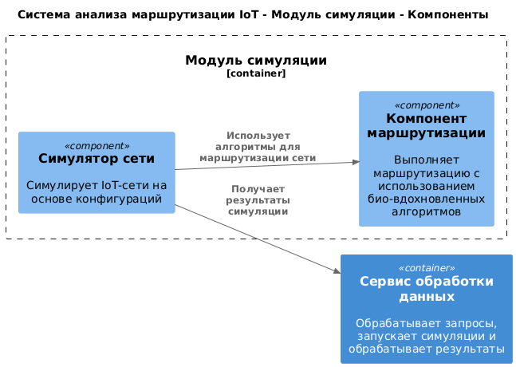

## Лабораторная работа №2.

### Диаграмма системного контекста

Диаграмма системного контекста показывает взаимодействие системы с внешними пользователями и другими системами. 

В данной диаграмме основные элементы:

**- Исследователь**: пользователь, который настраивает симуляции и анализирует результаты работы алгоритмов маршрутизации.

**- Система анализа маршрутизации в IoT**: центральный элемент, взаимодействующий с пользователями для выполнения симуляций, анализа и представления результатов.

### Диаграмма контейнеров

Диаграмма контейнеров отражает внутреннее устройство системы и демонстрирует, из каких крупных частей (контейнеров) она состоит:

**- Веб-приложение**: предоставляет интерфейс для взаимодействия пользователя с системой. Включает пользовательский интерфейс, компонент аутентификации и API-клиент для работы с серверной частью.

**- Сервис обработки данных**: принимает запросы от веб-приложения, выполняет обработку данных, передает их в модуль симуляции и взаимодействует с базой данных.

**- Модуль симуляции**: отвечает за реализацию биоинспирированных алгоритмов маршрутизации и моделирование сетей IoT.

**- База данных**: хранит конфигурации, результаты симуляций и метрики.

Выбрана клиент-серверная архитектура, что обеспечивает четкое разделение между интерфейсом и обработкой данных, а также масштабируемость и возможность независимого развития отдельных модулей.

### Диаграмма компонентов. Сервис обработки данных.

**- Обработчик API**: принимает запросы от веб-приложения и передает их на дальнейшую обработку.

**- Компонент обработки данных**: анализирует данные симуляций и вычисляет метрики.

**- Коннектор базы данных**: управляет взаимодействием с базой данных.

### Диаграмма компонентов. Модуль симуляции.

**- Компонент алгоритмов маршрутизации**: реализует биоинспирированные алгоритмы.

**- Симулятор сети**: выполняет моделирование сетей IoT.