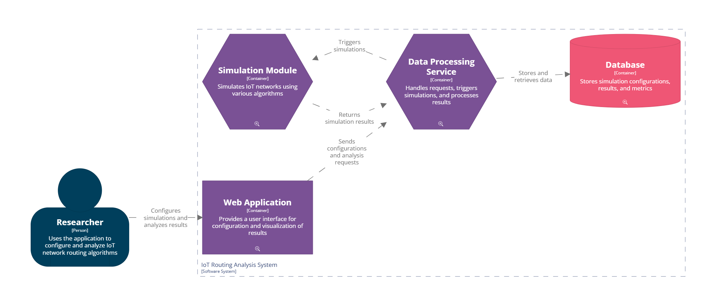
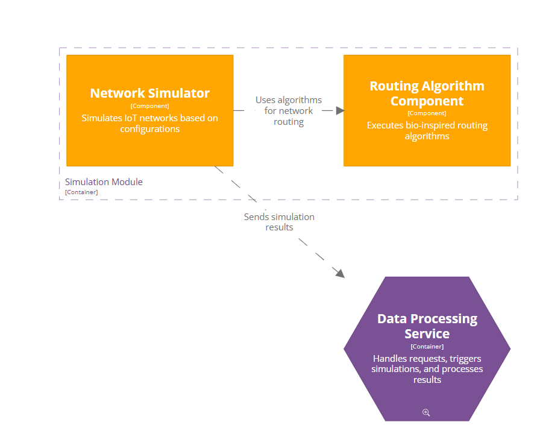
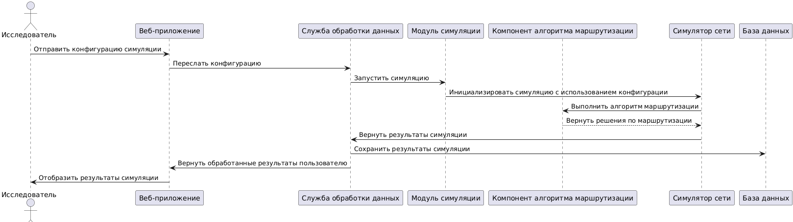
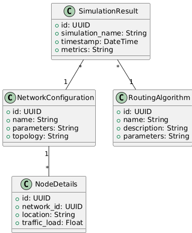

## Лабораторная работа №3

### Диаграмма контейнеров

Диаграмма контейнеров отражает внутреннее устройство системы и демонстрирует, из каких крупных частей (контейнеров) она состоит:

**- Веб-приложение**: предоставляет интерфейс для взаимодействия пользователя с системой. Включает пользовательский интерфейс, компонент аутентификации и API-клиент для работы с серверной частью.

**- Сервис обработки данных**: принимает запросы от веб-приложения, выполняет обработку данных, передает их в модуль симуляции и взаимодействует с базой данных.

**- Модуль симуляции**: отвечает за реализацию биоинспирированных алгоритмов маршрутизации и моделирование сетей IoT.

**- База данных**: хранит конфигурации, результаты симуляций и метрики.

Выбрана клиент-серверная архитектура, что обеспечивает четкое разделение между интерфейсом и обработкой данных, а также масштабируемость и возможность независимого развития отдельных модулей.

### Диаграмма компонентов Simulation Module


- Network Simulator использует Routing Algorithm Component для выполнения алгоритмов маршрутизации.

- Network Simulator отправляет результаты обратно в Data Processing Service для дальнейшей обработки и сохранения.


### Диаграмма последовательностей

Пояснение:

- Исследователь инициирует загрузку конфигурации сети и запускает симуляцию.

- Network Simulator использует алгоритмы маршрутизации и формирует результаты.

- Result Handler сохраняет и возвращает обработанные данные.

### Модель БД


Пояснение:

- NetworkConfiguration: Хранит данные о топологии и параметрах сети.
- NodeDetails: Содержит информацию об узлах IoT-сети.
- SimulationResult: Сохраняет результаты симуляций и их метрики.
- RoutingAlgorithm: Хранит информацию о применяемых алгоритмах маршрутизации.

### Применение основных принципов разработки
```# Пример реализации Simulation Module
class SimulationModule:
    def __init__(self):
        self.network_simulator = NetworkSimulator()
        self.routing_algorithms = {
            "ant_colony": AntColonyAlgorithm(),
            "bee_algorithm": BeeAlgorithm()
        }

    def run_simulation(self, network_config, algorithm_name):
        """
        Запускает симуляцию с заданной конфигурацией сети и алгоритмом маршрутизации.
        """
        algorithm = self.routing_algorithms.get(algorithm_name)
        if not algorithm:
            raise ValueError(f"Routing algorithm '{algorithm_name}' is not supported")

        self.network_simulator.configure(network_config)
        results = self.network_simulator.simulate(algorithm)
        return results


class NetworkSimulator:
    def __init__(self):
        self.config = None

    def configure(self, config):
        """
        Настраивает параметры сети.
        """
        self.config = config
        print(f"Network configured with: {config}")

    def simulate(self, routing_algorithm):
        """
        Выполняет симуляцию с использованием указанного алгоритма маршрутизации.
        """
        print(f"Simulating network with algorithm: {routing_algorithm.name}")
        results = routing_algorithm.run(self.config)
        print(f"Simulation completed: {results}")
        return results


# Интерфейс для алгоритмов маршрутизации (SOLID: Dependency Inversion Principle)
class RoutingAlgorithm:
    def run(self, network_config):
        raise NotImplementedError("This method should be implemented by subclasses")


class AntColonyAlgorithm(RoutingAlgorithm):
    """
    Реализация алгоритма на основе муравьиных колоний.
    """
    name = "Ant Colony Optimization"

    def run(self, network_config):
        # Упрощённый пример работы алгоритма
        print("Running Ant Colony Optimization...")
        return {"path": "optimized_path", "latency": 10, "throughput": 500}


class BeeAlgorithm(RoutingAlgorithm):
    """
    Реализация алгоритма на основе поведения пчелиного роя.
    """
    name = "Bee Optimization"

    def run(self, network_config):
        # Упрощённый пример работы алгоритма
        print("Running Bee Optimization...")
        return {"path": "optimized_path", "latency": 15, "throughput": 450}

```
Применение принципов:

**KISS**: Простая и читаемая структура модулей.

**DRY**: Конфигурации и алгоритмы переиспользуются, не дублируются.

**SOLID**:

* Single Responsibility Principle (SRP), каждая сущность отвечает за свою задачу:

   + ```SimulationModule``` управляет симуляцией.

   + ```NetworkSimulator``` отвечает за симуляцию сети.

   + Алгоритмы маршрутизации отвечают за свою логику.

* Open/Closed Principle (OCP):

  + Просто создаётся новый класс, реализующий интерфейс ```RoutingAlgorithm```.

* Liskov Substitution Principle (LSP):

  + Все алгоритмы маршрутизации можно заменить друг другом, не нарушая работу системы.

* Interface Segregation Principle (ISP):

  + Интерфейс ```RoutingAlgorithm``` минимален и включает только метод run.

* Dependency Inversion Principle (DIP):

  + ```SimulationModule``` зависит от абстракции ```RoutingAlgorithm```, а не от конкретных реализаций алгоритмов.
