## Лабораторная работа №4

## 1. Документация по API
 Ниже описано REST API для Data Processing Service, обеспечивающего управление конфигурациями сети и результатами симуляций, а также запуск новых симуляций.

### 1.1 Ключевые проектные решения (Design Decisions)
1. **Версионирование API** 
    * Все конечные точки (эндпоинты) начинаются с префикса /api/v1, что позволит в будущем вводить новые версии API без нарушения совместимости.


2. **Ресурсно-ориентированные URL**
    * Используются существительные во множественном числе для названий ресурсов: configurations, simulations (/api/v1/configurations/{config_id}).

3. **Использование стандартных HTTP-методов**

    * GET — для чтения ресурсов (или списка ресурсов),
    * POST — для создания новых ресурсов или запуска процессов,
    * PUT — для полного обновления ресурса,
    * DELETE — для удаления ресурса.

4. **Использование JSON как формата обмена данными**

    * Все входящие и исходящие данные кодируются в JSON для упрощённой интеграции с клиентами.
5. **Использование корректных HTTP-кодов состояния**
    * 200 OK — успешный запрос,
    * 201 Created — создан новый ресурс,
    * 400 Bad Request — некорректные данные запроса,
    * 404 Not Found — ресурс не найден,
    * 500 Internal Server Error — внутренняя ошибка сервера.

6. **Использование Path Parameters и Query Parameters**
    * Параметры пути (например, {id}) — для идентификации конкретного ресурса.
    * Параметры запроса (например, ?limit=10) — для фильтрации или ограничения результатов.
7. **Валидация входящих данных**
    * На уровне контроллера (endpoint) проверяются обязательные поля и форматы данных
    * При некорректных данных возвращается 400 Bad Request.
8. **Документирование и тестирование**
    * Определён чёткий формат описания эндпоинтов для удобства поддержки API.
    * Предусмотрены тесты в Postman с проверкой тела ответа и кода состояния.
### 1.2 Описание конечных точек (Endpoints)
1. **Получение списка конфигураций (GET)**
    * Возвращает список существующих конфигураций сети.
    * Query (необязательные):
        * limit (число) — ограничение кол-ва возвращаемых конфигураций.
        * offset (число) — смещение для постраничного вывода.
    * Пример запроса:
```GET /api/v1/configurations?limit=10&offset=0```
    * Пример ответа:
        ```[
        {
            "id": 1,
            "name": "Test Config #1",
            "description": "Initial network setup"
        },
        {
            "id": 2,
            "name": "Big Network",
            "description": "Configuration for large-scale simulation"
        }
        ]```

2. Получение конкретной конфигурации(GET)
    * Возвращает данные о конкретной конфигурации сети.

    * Пример запроса:```GET /api/v1/configurations/1```
    * Пример ответа:
        ```
        {
            "id": 1,
        "name": "Test Config #1",
        "description": "Initial network setup",
        "nodes": [
            {"nodeId": 101, "type": "sensor", "location": "Room A"},
            {"nodeId": 102, "type": "actuator", "location": "Room B"}
        ]
        }
    * Ответ в случае несуществующего ресурса:
        ```
        {
            "error": "Configuration not found"
        }
        ```
3. Создание новой конфигурации(POST)
    * Создаёт новую конфигурацию сети.
    * Тело запроса:
        ```
        {
        "name": "My New Config",
        "description": "Description here",
        "nodes": [
            {"nodeId": 201, "type": "sensor", "location": "Floor 2"}
        ]
        }
        ```
    * Пример ответа:
        ```
        {
        "id": 3,
        "name": "My New Config",
        "description": "Description here",
        "nodes": [
            {"nodeId": 201, "type": "sensor", "location": "Floor 2"}
        ]
        }
        ```
4. Обновление конфигурации(PUT)
    * Полностью обновляет данные о конфигурации сети.

    * Тело запроса:
    ```
        {
        "name": "Updated Config",
        "description": "Updated description",
        "nodes": [
            {"nodeId": 101, "type": "sensor", "location": "New Location A"},
            {"nodeId": 102, "type": "sensor", "location": "New Location B"}
        ]
        }
    ```
    * Пример ответа:
    ```
        {
        "id": 1,
        "name": "Updated Config",
        "description": "Updated description",
        "nodes": [
            {"nodeId": 101, "type": "sensor", "location": "New Location A"},
            {"nodeId": 102, "type": "sensor", "location": "New Location B"}
        ]
        }
    ```
5. Удаление конфигурации(DELETE)
    * Удаляет конфигурацию сети.
    * Пример ответа :
    ```
        {
        "message": "Configuration deleted successfully"
        }
    ```
6. Запуск симуляции(POST)
    * Запускает симуляцию по заданной конфигурации сети и алгоритму.
    * Тело запроса:
        ```
            {
            "config_id": 1,
            "algorithm": "ant_colony"
            }
        ```
    * Пример ответа:
        ```
        {
        "simulation_id": 10,
        "status": "running",
        "config_id": 1,
        "algorithm": "ant_colony"
        }
        ```
7. Получение результата симуляции(GET)
    * Возвращает текущий статус и (при завершении) результат симуляции.
    * Пример ответа:
    ```
        {
        "simulation_id": 10,
        "status": "completed",
        "result": {
            "path": "optimized_path",
            "latency": 10,
            "throughput": 500
        }
        }
    ```
    * Ответ в случае несуществующего ресурса:
        ```
        {
        "error": "Simulation not found"
        }
        ```
### 2. Пример реализации API (на Python + Flask)
Нижепреведен пример кода описывающий минимальную логику элементов.
```
from flask import Flask, request, jsonify
app = Flask(__name__)

# Временные хранилища данных
configurations = [
    {"id": 1, "name": "Test Config #1", "description": "Initial network setup", "nodes": []},
    {"id": 2, "name": "Big Network", "description": "Configuration for large-scale simulation", "nodes": []}
]
simulations = []
simulation_counter = 0

@app.route('/api/v1/configurations', methods=['GET'])
def get_configurations():
    limit = request.args.get('limit', default=None, type=int)
    offset = request.args.get('offset', default=0, type=int)
    # Простая эмуляция постраничного вывода
    data = configurations[offset:]
    if limit:
        data = data[:limit]
    return jsonify(data), 200

@app.route('/api/v1/configurations/<int:config_id>', methods=['GET'])
def get_configuration(config_id):
    config = next((c for c in configurations if c["id"] == config_id), None)
    if config:
        return jsonify(config), 200
    return jsonify({"error": "Configuration not found"}), 404

@app.route('/api/v1/configurations', methods=['POST'])
def create_configuration():
    new_config = request.json
    if not new_config.get("name"):
        return jsonify({"error": "Name is required"}), 400
    new_id = max(c["id"] for c in configurations) + 1 if configurations else 1
    new_config["id"] = new_id
    configurations.append(new_config)
    return jsonify(new_config), 201

@app.route('/api/v1/configurations/<int:config_id>', methods=['PUT'])
def update_configuration(config_id):
    config = next((c for c in configurations if c["id"] == config_id), None)
    if not config:
        return jsonify({"error": "Configuration not found"}), 404
    updated_data = request.json
    config.update(updated_data)
    return jsonify(config), 200

@app.route('/api/v1/configurations/<int:config_id>', methods=['DELETE'])
def delete_configuration(config_id):
    global configurations
    if not any(c["id"] == config_id for c in configurations):
        return jsonify({"error": "Configuration not found"}), 404
    configurations = [c for c in configurations if c["id"] != config_id]
    return jsonify({"message": "Configuration deleted successfully"}), 200

@app.route('/api/v1/simulations', methods=['POST'])
def run_simulation():
    global simulation_counter
    data = request.json
    config_id = data.get("config_id")
    algorithm = data.get("algorithm", "ant_colony")
    # Проверяем, что конфигурация существует
    config = next((c for c in configurations if c["id"] == config_id), None)
    if not config:
        return jsonify({"error": "Configuration not found"}), 404
    simulation_counter += 1
    sim_id = simulation_counter
    sim_info = {
        "simulation_id": sim_id,
        "status": "running",
        "config_id": config_id,
        "algorithm": algorithm
    }
    simulations.append(sim_info)
    return jsonify(sim_info), 201

@app.route('/api/v1/simulations/<int:simulation_id>', methods=['GET'])
def get_simulation_result(simulation_id):
    sim = next((s for s in simulations if s["simulation_id"] == simulation_id), None)
    if not sim:
        return jsonify({"error": "Simulation not found"}), 404
    
    # Для примера считаем, что симуляция всегда сразу завершена
    sim["status"] = "completed"
    sim["result"] = {
        "path": "optimized_path",
        "latency": 10,
        "throughput": 500
    }
    return jsonify(sim), 200

if __name__ == '__main__':
    app.run(debug=True)
```
### 3. Тестирование API
**1. Пример тестирования GET /api/v1/configurations**
    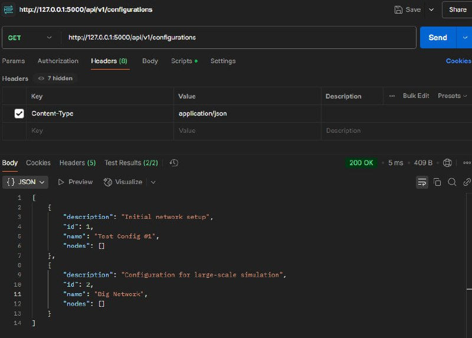
    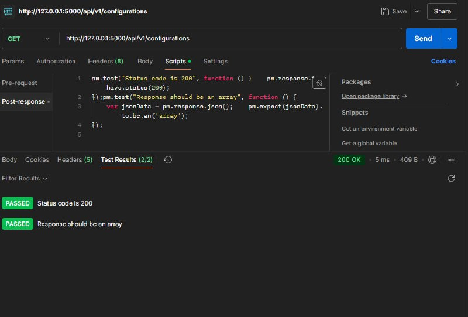
**2. Пример тестирования POST /api/v1/configurations**
    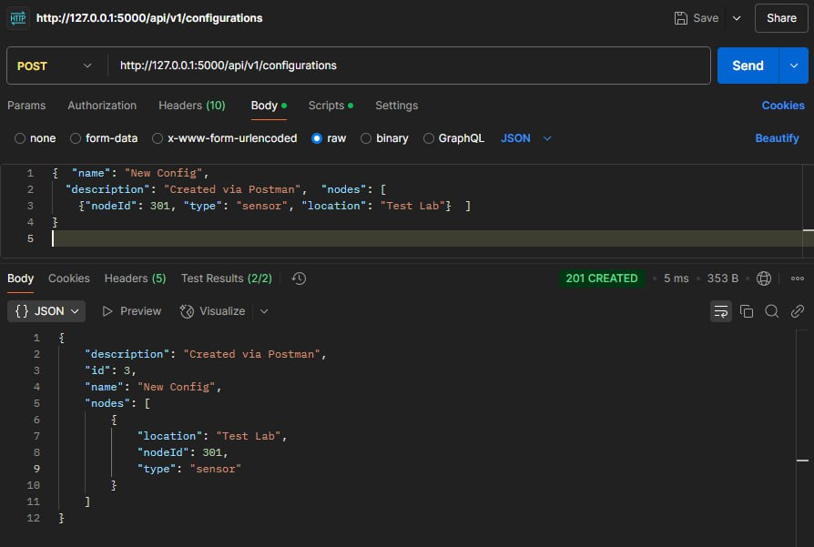
    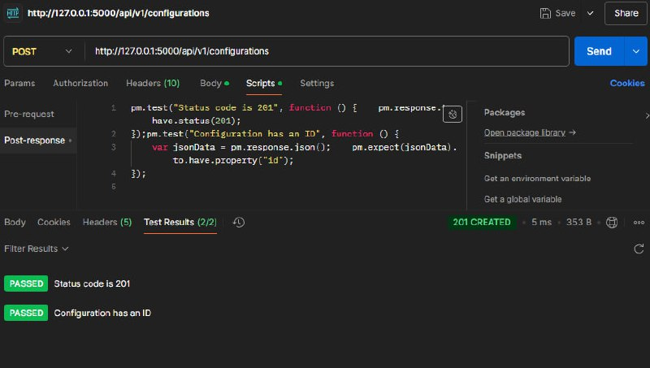
**3. Пример тестирования PUT /api/v1/configurations/1**
    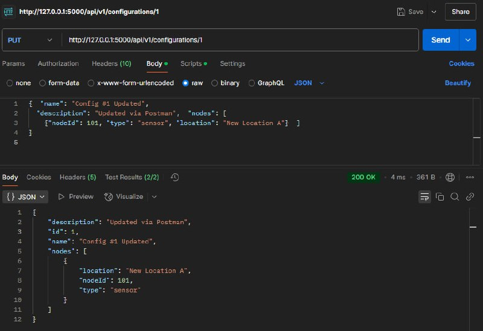
    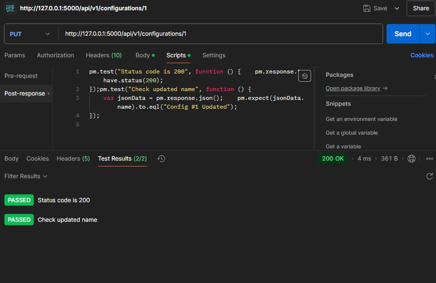
**4. Пример тестирования DELETE /api/v1/configurations/1**
    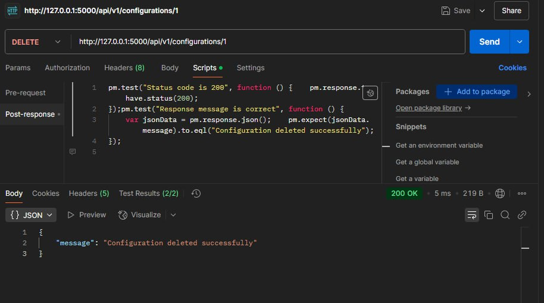
    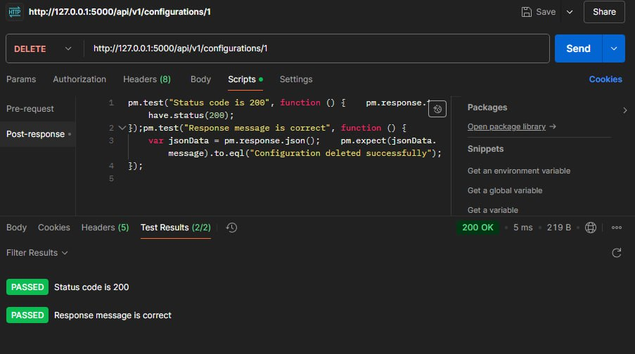
**5. Пример тестирования POST /api/v1/simulations**
    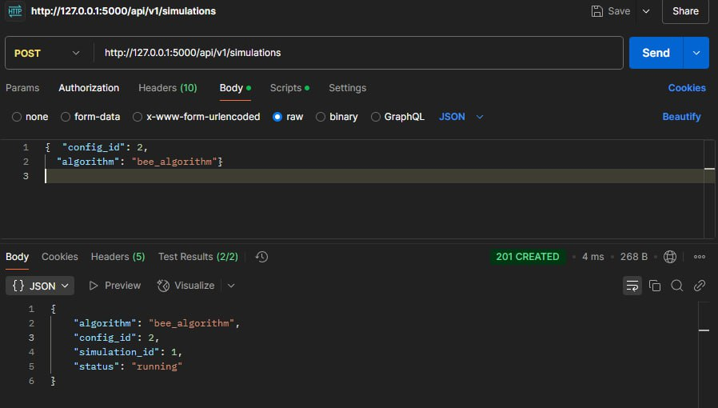
    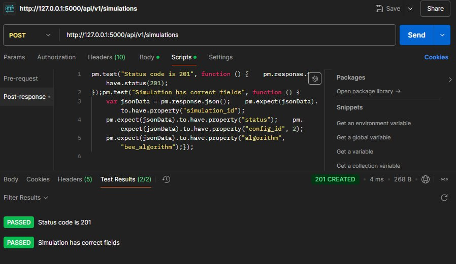
**6. Пример тестирования GET /api/v1/simulations/{simulation_id}**
    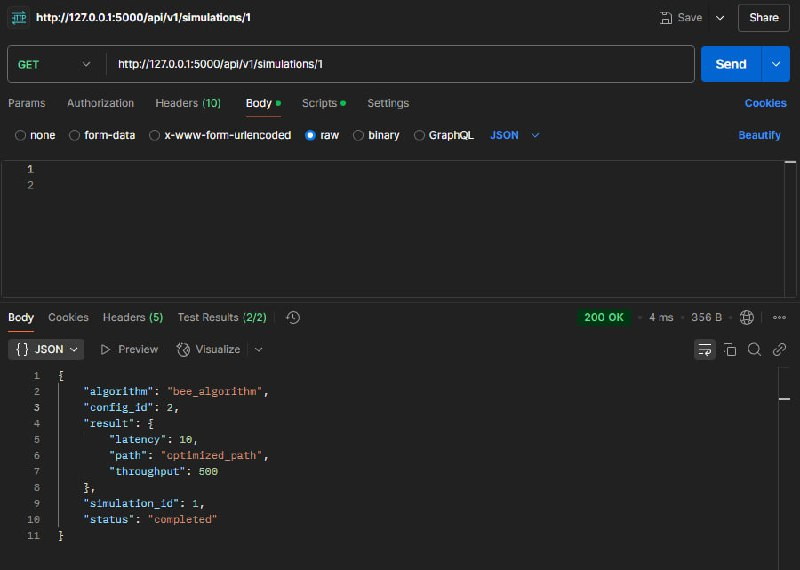
    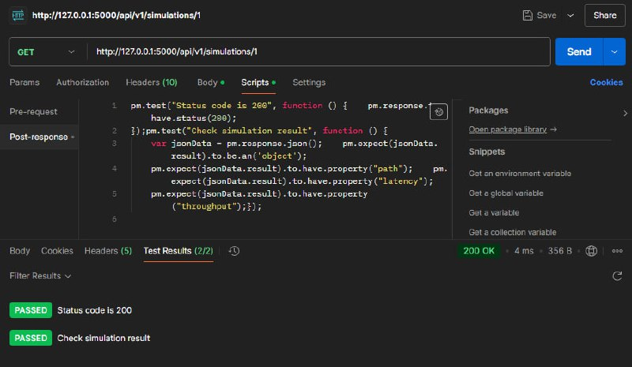