## Лабораторная работа №5

### Краткое описание системы
Краткое описание систем, выбранных для реализации микросервисов:
* **Data Processing Service**: Отвечает за доступ к конфигурациям сети, сохранение и выдачу результатов симуляции, а также за взаимодействие с БД.
* **Simulation Service**: Отвечает непосредственно за запуск симуляций, содержит логику биоинспирированных алгоритмов (например, Ant Colony, Bee Algorithm и др.). Для получения данных конфигурации и сохранения результатов общается с DPS по REST API.
### Упаковка сервисов в Docker-контейнеры
* Dockerfile для Data Processing Service
* Dockerfile для Simulation Service

### Пример Dockerfile для Data Processing Service:
```
FROM python:3.10

WORKDIR /app

COPY requirements.txt ./
RUN pip install --no-cache-dir -r requirements.txt

COPY app.py ./

EXPOSE 5001

CMD [ "python", "app.py" ]
```
Упрощенный пример кода компонента:

```
from flask import Flask, request, jsonify

app = Flask(__name__)

# Временное хранилище конфигураций (для демонстрации)
configurations = []

@app.route('/configs', methods=['GET'])
def get_configs():
    return jsonify(configurations), 200

@app.route('/configs', methods=['POST'])
def create_config():
    data = request.json
    if 'name' not in data:
        return jsonify({"error": "Missing name"}), 400
    new_id = len(configurations) + 1
    config = {
        "id": new_id,
        "name": data['name'],
        "description": data.get('description', '')
    }
    configurations.append(config)
    return jsonify(config), 201

if __name__ == "__main__":
    # Запуск на порту 5001
    app.run(host='0.0.0.0', port=5001)
```
ИТОГ:
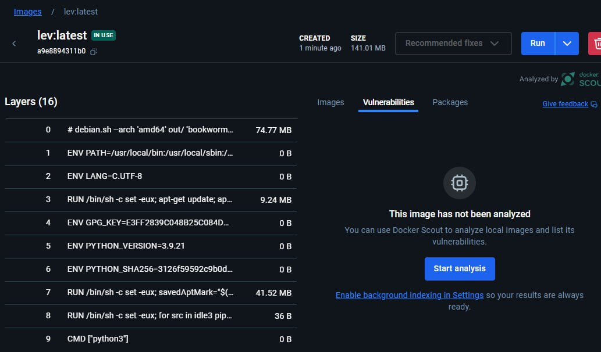
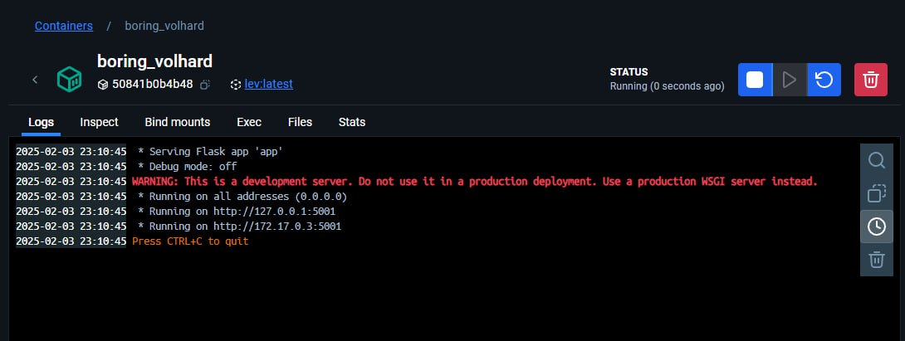

### Аналогично для Dockerfile для Simulation Service
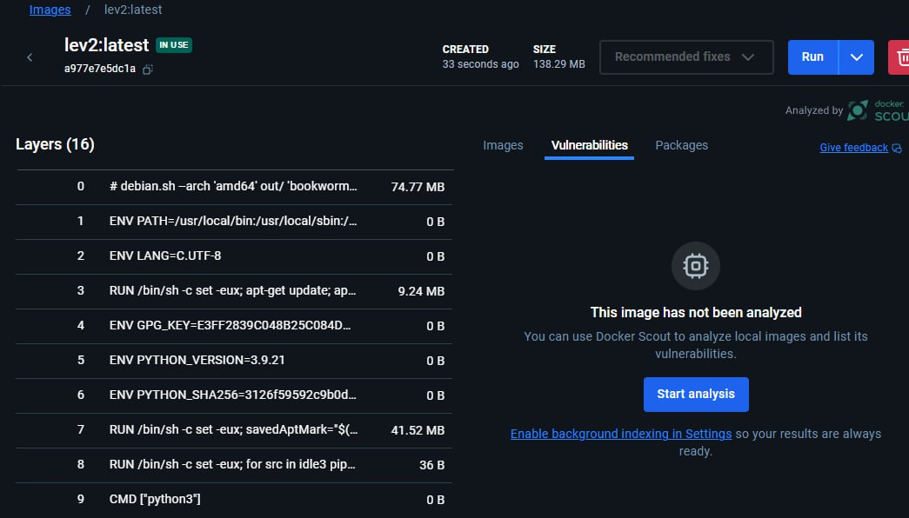
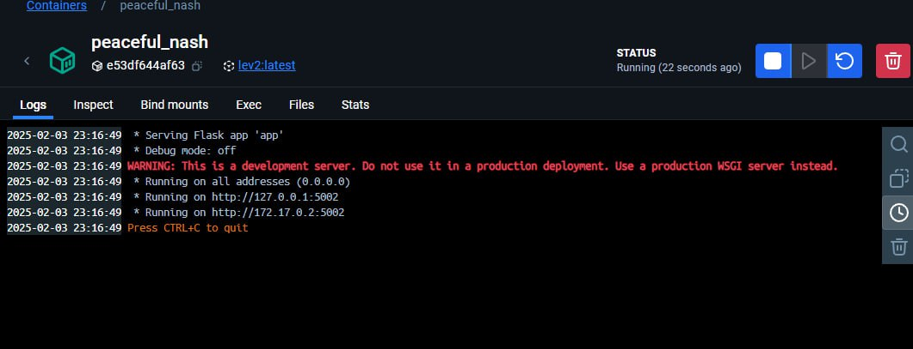
### Оба контейнера:
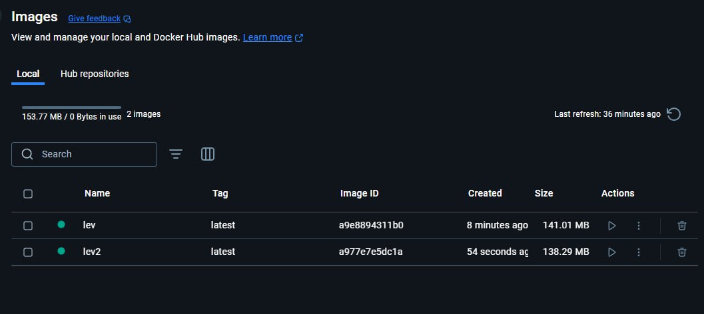
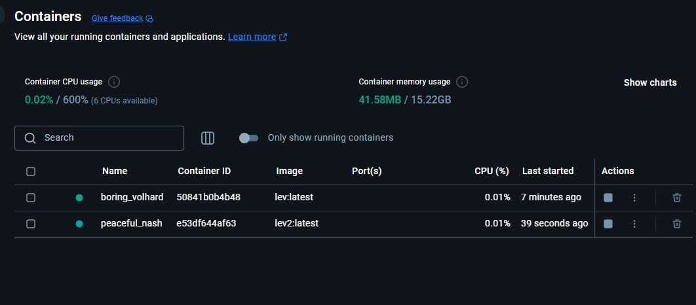
### Организация микросервисной архитектуры с помощью Docker Compose
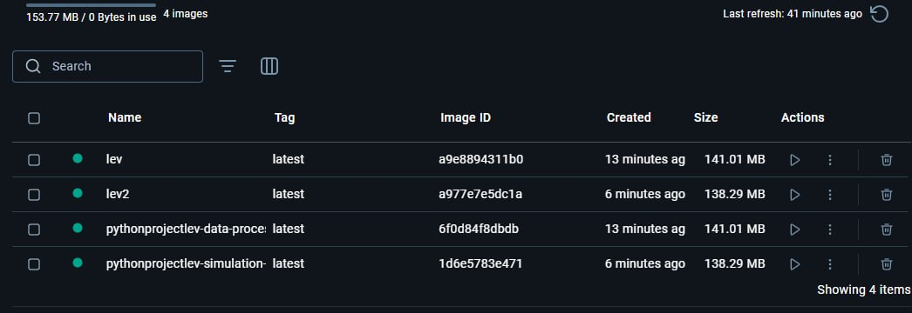
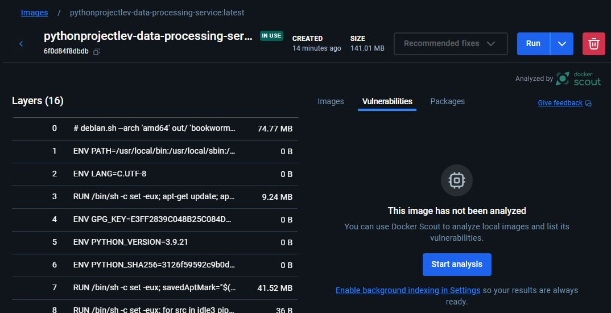
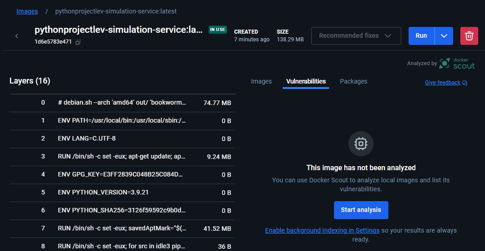
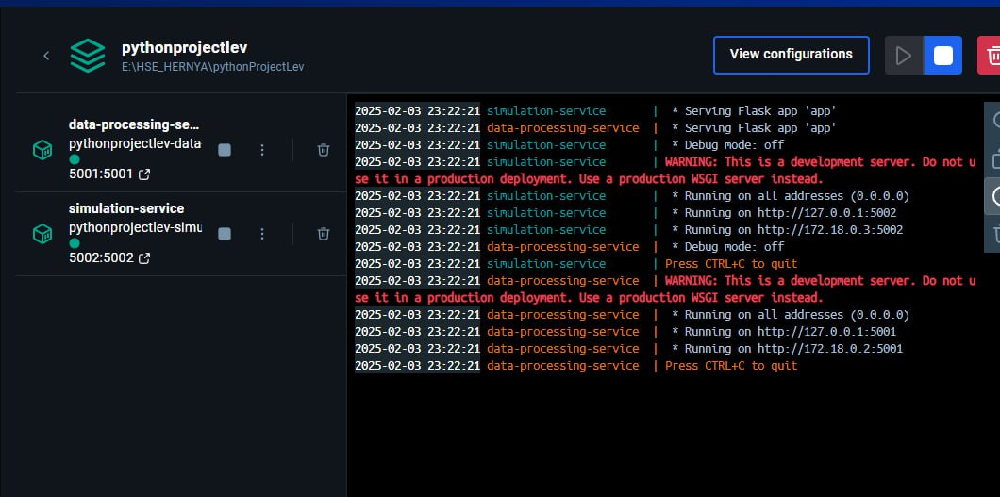
### Настройка непрерывной интеграции (CI) и непрерывного развертывания (CD)
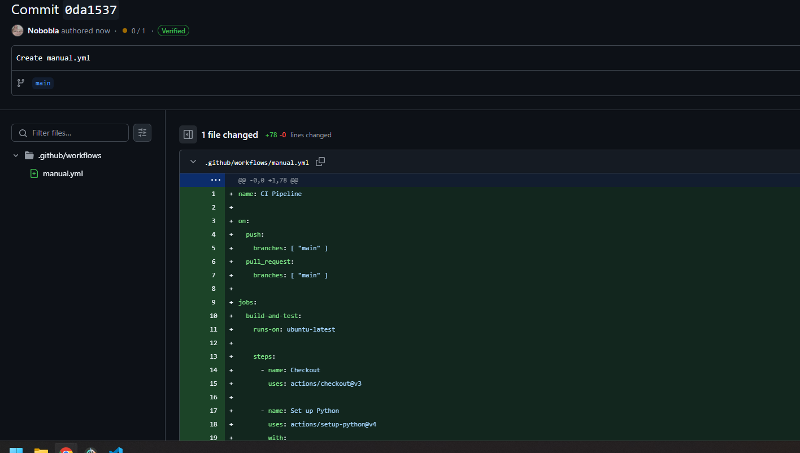

### Интеграционные тесты
Для интеграционных тестов мы можем использовать либо Postman-тесты, либо, как в примере выше, простые curl-вызовы.
Также можно написать pytest-скрипт, который будет обращаться к поднятым сервисам:
```
import requests
import pytest
import time

BASE_URL_DPS = "http://localhost:5001"
BASE_URL_SS = "http://localhost:5002"

def test_create_config():
    resp = requests.post(f"{BASE_URL_DPS}/configs", json={"name": "TestConfig"})
    assert resp.status_code == 201
    json_data = resp.json()
    assert "id" in json_data

def test_simulation():
    # Предположим, что создаём конфигурацию, получаем ее id
    config_resp = requests.post(f"{BASE_URL_DPS}/configs", json={"name": "ConfigForSimulation"})
    assert config_resp.status_code == 201
    config_id = config_resp.json()["id"]

    sim_resp = requests.post(f"{BASE_URL_SS}/simulate", json={"config_id": config_id, "algorithm": "ant_colony"})
    assert sim_resp.status_code == 200
    sim_data = sim_resp.json()
    assert sim_data["status"] == "completed"
    assert sim_data["config_id"] == config_id
```
Результат:
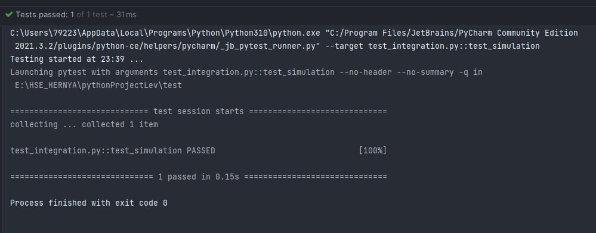
