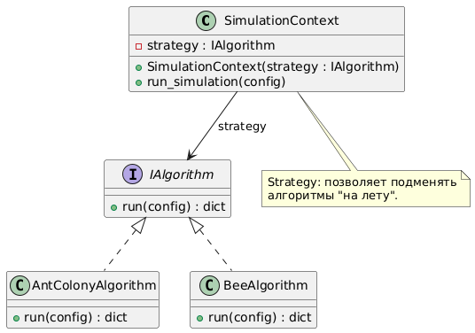

# Лабораторная работа №6

# Шаблоны проектирования GoF

## Порождающие шаблоны
### 1. Singleton

**Назначение**: Гарантирует, что у класса есть только один экземпляр, и предоставляет глобальную точку доступа к этому экземпляру.


```
class Database:
    __instance = None

    def __init__(self):
        if Database.__instance is not None:
            raise Exception("Use get_instance() instead of constructor.")
        self.connection = self.connect_db()

    @staticmethod
    def get_instance():
        if Database.__instance is None:
            Database.__instance = Database()
        return Database.__instance

    def connect_db(self):
        print("Connecting to DB...")
        return "DB_Connection_Object"

    def close_db(self):
        print("Closing DB connection...")

# Использование:
db1 = Database.get_instance()
db2 = Database.get_instance()
assert db1 is db2  # True — один и тот же объект
```
### 2. Factory Method

**Назначение**: Определяет интерфейс для создания объектов, но позволяет подклассам решать, какой класс инстанцировать.


```
class RoutingAlgorithm:
    def run(self, network_config):
        raise NotImplementedError()

class AntColonyAlgorithm(RoutingAlgorithm):
    def run(self, network_config):
        return {"method": "Ant Colony", "result": "Optimized path"}

class BeeAlgorithm(RoutingAlgorithm):
    def run(self, network_config):
        return {"method": "Bee Algorithm", "result": "Alternative path"}

class RoutingAlgorithmFactory:
    @staticmethod
    def create_algorithm(algorithm_type: str) -> RoutingAlgorithm:
        if algorithm_type == "ant_colony":
            return AntColonyAlgorithm()
        elif algorithm_type == "bee":
            return BeeAlgorithm()
        else:
            raise ValueError(f"Unknown algorithm type: {algorithm_type}")

# Использование:
factory = RoutingAlgorithmFactory()
algo = factory.create_algorithm("ant_colony")
result = algo.run({"nodes": []})
```
### 3. Builder

**Назначение**: Отделяет конструирование сложного объекта от его представления, так что в результате одного и того же процесса конструирования могут получаться разные представления.


```
class NetworkConfig:
    def __init__(self):
        self.nodes = []
        self.edges = []
        self.parameters = {}

class NetworkBuilder:
    def __init__(self):
        self.config = NetworkConfig()

    def add_node(self, node_id, node_type):
        self.config.nodes.append({"id": node_id, "type": node_type})
        return self

    def add_edge(self, from_node, to_node):
        self.config.edges.append((from_node, to_node))
        return self

    def set_parameter(self, key, value):
        self.config.parameters[key] = value
        return self

    def build(self):
        return self.config

# Использование:
builder = NetworkBuilder()
config = (builder
          .add_node(1, "sensor")
          .add_node(2, "actuator")
          .add_edge(1, 2)
          .set_parameter("transmit_power", 10)
          .build())
```
## Структурные шаблоны
### 1. Adapter
**Назначение**: Преобразует интерфейс класса к другому интерфейсу, который ожидают клиенты. Позволяет классам с несовместимыми интерфейсами работать вместе.


```
class IJsonSender:
    def send_data(self, data):
        raise NotImplementedError()

class JsonSender(IJsonSender):
    def send_data(self, data):
        print(f"Sending JSON: {data}")

class XmlService:
    def send_xml(self, xml_data):
        print(f"Sending XML: {xml_data}")

class XmlAdapter(IJsonSender):
    def __init__(self, xml_service):
        self.xml_service = xml_service

    def send_data(self, data):
        # Конвертация data (предположим, JSON) в XML
        xml_data = f"<xml><data>{data}</data></xml>"
        self.xml_service.send_xml(xml_data)

# Использование:
xml_svc = XmlService()
adapter = XmlAdapter(xml_svc)
adapter.send_data({"msg": "test"})  # внутри конвертирует в XML
```
### 2. Facade
**Назначение**: Предоставляет унифицированный интерфейс к набору интерфейсов подсистемы. Фасад определяет высокоуровневый интерфейс, упрощающий работу с подсистемой.


```
class ConfigModule:
    def load_config(self, config_id):
        print(f"Loading config {config_id}")
        return {"id": config_id, "nodes": []}

class SimulationModule:
    def run_simulation(self, config):
        print(f"Running simulation on config {config['id']}")
        return {"status": "done", "result": "Optimized path"}

class SimulationFacade:
    def __init__(self):
        self.config_module = ConfigModule()
        self.simulation_module = SimulationModule()

    def start_simulation(self, config_id):
        config = self.config_module.load_config(config_id)
        result = self.simulation_module.run_simulation(config)
        return result

# Использование:
facade = SimulationFacade()
output = facade.start_simulation(1)
print(output)
```
### 3. Proxy
**Назначение**: Представляет собой суррогатный объект, контролирующий доступ к другому объекту. Может добавлять дополнительное поведение (кеширование, контроль доступа и т.д.).


```
class IDatabase:
    def query(self, q):
        raise NotImplementedError()

class RealDatabase(IDatabase):
    def query(self, q):
        print(f"Executing query on real DB: {q}")
        return "some_result"

class DatabaseProxy(IDatabase):
    def __init__(self):
        self.real_db = None

    def query(self, q):
        if self.real_db is None:
            print("Initializing real DB connection lazily...")
            self.real_db = RealDatabase()
        print("Proxy: Checking access rights or caching...")
        return self.real_db.query(q)

# Использование:
db_proxy = DatabaseProxy()
result = db_proxy.query("SELECT * FROM configs")
```
### 4. Decoraator
**Назначение**: Динамически добавляет объектам новые обязанности. Является альтернативой наследованию при расширении функциональности.


```
class ISimulationAlgorithm:
    def run(self, config):
        pass

class ConcreteAlgorithm(ISimulationAlgorithm):
    def run(self, config):
        print("Executing main simulation logic...")
        return {"status": "ok"}

class AlgorithmDecorator(ISimulationAlgorithm):
    def __init__(self, wrappee: ISimulationAlgorithm):
        self.wrappee = wrappee

    def run(self, config):
        return self.wrappee.run(config)

class LoggingDecorator(AlgorithmDecorator):
    def run(self, config):
        print("[LOG] Start simulation")
        result = super().run(config)
        print("[LOG] End simulation")
        return result

# Использование:
algo = ConcreteAlgorithm()
decorated_algo = LoggingDecorator(algo)
res = decorated_algo.run({"param": 1})
```
## Поведенческие шаблоны
### 1. Strategy
**Назначение**: Преобразует интерфейс класса к другому интерфейсу, который ожидают клиенты. Позволяет классам с несовместимыми интерфейсами работать вместе.


```
class IAlgorithm:
    def run(self, config):
        raise NotImplementedError()

class AntColonyAlgorithm(IAlgorithm):
    def run(self, config):
        return {"method": "AntColony"}

class BeeAlgorithm(IAlgorithm):
    def run(self, config):
        return {"method": "Bee"}

class SimulationContext:
    def __init__(self, strategy: IAlgorithm):
        self.strategy = strategy

    def run_simulation(self, config):
        return self.strategy.run(config)

# Использование:
ant_strategy = AntColonyAlgorithm()
ctx = SimulationContext(ant_strategy)
result = ctx.run_simulation({"nodes": []})
print(result)
```
### 2. Observer
**Назначение**: Определяет зависимость «один-ко-многим» между объектами. При изменении состояния одного объекта все «наблюдатели» оповещаются и обновляются автоматически.

```
class Observer:
    def update(self, data):
        pass

class SimulationSubject:
    def __init__(self):
        self.observers = []
        self._state = "not_started"

    def attach(self, obs: Observer):
        self.observers.append(obs)

    def detach(self, obs: Observer):
        self.observers.remove(obs)

    def notify(self):
        for obs in self.observers:
            obs.update(self._state)

    def start_simulation(self):
        self._state = "running"
        self.notify()
        # ... некая работа ...
        self._state = "finished"
        self.notify()

class LoggerObserver(Observer):
    def update(self, data):
        print(f"[LOGGER] Simulation state changed to: {data}")

# Использование:
subject = SimulationSubject()
logger = LoggerObserver()
subject.attach(logger)
subject.start_simulation()
```
### 2. Template Method
**Назначение**: Определяет скелет алгоритма в методе, позволяя подклассам переопределять отдельные шаги алгоритма, не меняя его структуры.

```
class AbstractSimulation:
    def run_simulation(self):
        self.initialize()
        self.simulate()
        self.finalize()

    def initialize(self):
        pass

    def simulate(self):
        raise NotImplementedError()

    def finalize(self):
        pass

class WifiSimulation(AbstractSimulation):
    def initialize(self):
        print("Init Wi-Fi parameters")

    def simulate(self):
        print("Run Wi-Fi simulation")

    def finalize(self):
        print("Cleanup Wi-Fi resources")

# Использование:
sim = WifiSimulation()
sim.run_simulation()
```
### 2. Command
**Назначение**: Инкапсулирует запрос как объект, позволяя варьировать клиентов с различными запросами и поддерживать операции (например, отмену и повтор).

```
class Command:
    def execute(self):
        pass

class Network:
    def add_node(self, node_id):
        print(f"Network: adding node {node_id}")

    def remove_node(self, node_id):
        print(f"Network: removing node {node_id}")

class AddNodeCommand(Command):
    def __init__(self, network, node_id):
        self.network = network
        self.node_id = node_id

    def execute(self):
        self.network.add_node(self.node_id)

class RemoveNodeCommand(Command):
    def __init__(self, network, node_id):
        self.network = network
        self.node_id = node_id

    def execute(self):
        self.network.remove_node(self.node_id)

# Использование:
net = Network()
cmd_queue = [
    AddNodeCommand(net, 1),
    AddNodeCommand(net, 2),
    RemoveNodeCommand(net, 1)
]

for cmd in cmd_queue:
    cmd.execute()
```
### 2. State
**Назначение**: Позволяет объекту изменять своё поведение при смене внутреннего состояния.

```
class IState:
    def start(self, ctx):
        pass
    def stop(self, ctx):
        pass

class NotStartedState(IState):
    def start(self, ctx):
        print("Simulation started")
        ctx.set_state(RunningState())
    def stop(self, ctx):
        print("Cannot stop, not started yet")

class RunningState(IState):
    def start(self, ctx):
        print("Already running")
    def stop(self, ctx):
        print("Simulation finished")
        ctx.set_state(FinishedState())

class FinishedState(IState):
    def start(self, ctx):
        print("Cannot restart after finish")
    def stop(self, ctx):
        print("Already finished")

class SimulationContext:
    def __init__(self):
        self.state = NotStartedState()

    def set_state(self, state: IState):
        self.state = state

    def start(self):
        self.state.start(self)

    def stop(self):
        self.state.stop(self)

# Использование:
ctx = SimulationContext()
ctx.stop()   # "Cannot stop, not started yet"
ctx.start()  # "Simulation started"
ctx.start()  # "Already running"
ctx.stop()   # "Simulation finished"
ctx.stop()   # "Already finished"
```
# Шаблоны проектирования GRASP
# Роли (обязанности) классов
## 1. Creator
**Проблема:** Как определить, какой класс должен создавать объекты другого класса?  
**Решение:** Класс, который содержит или агрегирует объекты (либо использует большинство данных объекта), является «создателем».  

```
class SimulationModule:
    def create_algorithm(self, algo_type):
        return RoutingAlgorithmFactory.create_algorithm(algo_type)
```
**Результат:** Ответственность за создание алгоритмов делегируется фабрике, вызываемой из ```SimulationModule```.
**Связь**: Перекликается с Factory Method (GoF).

## 2. Information Expert
**Проблема:** Как определить, где хранить логику, связанную с данными?  
**Решение:** Класс, владеющий необходимыми данными, должен сам обрабатывать логику, связанную с этими данными.

```
class NetworkConfig:
    def __init__(self):
        self.nodes = []

    def add_node(self, node):
        self.nodes.append(node)

    def get_node_count(self):
        return len(self.nodes)
```
**Результат:** ```NetworkConfig``` хранит ```nodes``` и сам предоставляет методы для управления узлами.
**Связь:** Способствует High Cohesion и Low Coupling.

## 3. Controller
**Проблема:** Как распределить ответственность между слоями (UI, бизнес-логика, системные операции)?
**Решение:** Использовать отдельный класс-контроллер, отвечающий за обработку системных операций от интерфейса, не перегружая UI-код.

```
class SimulationController:
    def __init__(self, facade):
        self.facade = facade

    def handle_start_simulation(self, config_id):
        return self.facade.start_simulation(config_id)
```
**Результат:** Логика запуска симуляции не в UI-коде, а в ```SimulationController```.
**Связь:** Перекликается с Facade.

## 4. Polymorphism
**Проблема:** Как обрабатывать разные варианты поведения, зависящие от конкретного типа?
**Решение:** Использовать общий интерфейс и разные реализации (ООП-полиморфизм).
```
class RoutingAlgorithm:
    def run(self, network_config):
        pass

class AntColonyAlgorithm(RoutingAlgorithm):
    def run(self, network_config):
        print("Ant Colony logic")

class BeeAlgorithm(RoutingAlgorithm):
    def run(self, network_config):
        print("Bee logic")
```
**Результат:** При добавлении нового алгоритма логика меняется в новом классе, не затрагивая уже существующие.
**Связь:** Связан с паттернами Strategy и Factory Method.

## 5. High Cohesion
**Проблема:** Как сделать, чтобы класс выполнял связанную задачу, а не набор нерелевантных функций?
**Решение:** Распределять обязанности так, чтобы класс имел чёткую, фокусированную ответственность.
```
class ResultHandler:
    def __init__(self):
        self.results = {}

    def save_result(self, sim_id, result):
        self.results[sim_id] = result

    def get_result(self, sim_id):
        return self.results.get(sim_id)
```
**Результат:** ```ResultHandler``` отвечает только за работу с результатами симуляций.
**Связь:** Способствует увеличению понятности кода и облегчает сопровождение.

# Принципы разработки
## 1. Low Coupling
**Проблема:** При сильной связности любое изменение в одном модуле может затронуть множество других.
**Решение:** Минимизировать зависимости между классами, например, используя абстракции, интерфейсы, фабрики.
```
# SimulationService общается с DataProcessingService через REST, а не напрямую:
response = requests.get("http://data-processing-service:5001/configs")
```
**Результат:** Микросервисная архитектура — сервисы связаны через HTTP-интерфейсы, а не напрямую через классы.
**Связь:** Соответствует принципам SOLID (DIP) и паттернам Facade/Adapter.

## 2. Protected Variations
**Проблема:** Как защитить части системы от изменения в других частях?
**Решение:** Использовать стабильные интерфейсы и точки расширения (Factory Method, Strategy).
```
# При добавлении GeneticAlgorithm мы не меняем существующий код:
class GeneticAlgorithm(RoutingAlgorithm):
    def run(self, config):
        return {"method": "Genetic"}

# Просто регистрируем в фабрике:
elif algorithm_type == "genetic":
    return GeneticAlgorithm()
```
**Результат:** Остальные части (SimulationModule) не зависят от конкретных реализаций.
**Связь:** Напрямую поддерживается паттернами Factory Method, Strategy.

## 3. Indirection
**Проблема:** Необходимо избежать сильной зависимости двух компонентов друг от друга.
**Решение:** Использовать прослойку (например, Controller или Facade), которая перенаправляет вызовы.
```
class SimulationFacade:
    def __init__(self):
        self.config_module = ConfigModule()
        self.simulation_module = SimulationModule()

    def start_simulation(self, config_id):
        config = self.config_module.load_config(config_id)
        return self.simulation_module.run_simulation(config)
```
**Результат:** Клиенту (UI) достаточно знать лишь о ```SimulationFacade```, не зная деталей ```ConfigModule``` и ```SimulationModule```.
**Связь:** Напрямую поддерживается паттернами Factory Method, Strategy.

# Свойство программы
**Проблема:** Нужно уметь легко добавлять новые алгоритмы, типы узлов сети, сценарии симуляций и т.д.
**Решение:** Активно использовать паттерны (Factory Method, Strategy, Facade), а также принципы «Low Coupling», «High Cohesion».
```
# Благодаря фабрике при добавлении нового алгоритма
# мы почти не трогаем остальной код:
algo = factory.create_algorithm("new_algo")
result = algo.run(network_config)
```
**Результат:** Новые элементы добавляются без ломки существующей структуры.
**Связь:** Связано с паттернами GoF (особенно Strategy, Factory Method), а также GRASP (Polymorphism, Creator).